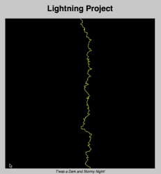
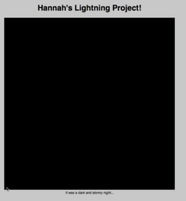
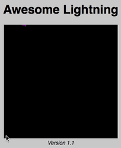
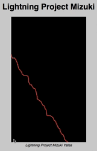
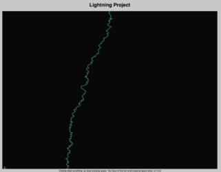
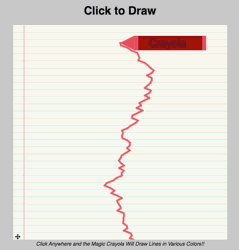

[_Bush School CPJava Fall Semester 2020_](https://chandrunarayan.github.io/cpjava/)

# Student Project Images

<table style="padding:10px">
<tr>
    
 
  <td>
    
  </td>

  <td>
    
  <td>

  <td> 
    
  </td>

  <td>
    
  </td>

<table style="padding:10px">
<tr>

  <td>
    
  </td>

  <td> 
    
  </td>
  
  <td>
    
  </td>

  <td>
    
  </td>

</tr>
</table>
