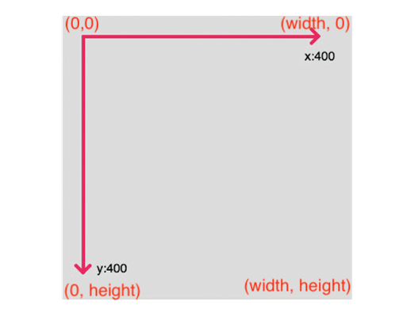

### While reading this example remember canvas coordinates are as follows:


The canvas above has width of 400 pixels and height of 400 pixels
```javascript
// Dynamic Rectangles
// Learn to code visually!
// text following // are help comments !!

let loc1 = 0; // set up a variable pixel location for rect1
let loc2 = 0; // set up a variable pixel location for rect2

function setup() { // this function is run once.   
  // canvas size in pixels
  // width is set to 600, and height to 200
  createCanvas(400, 200);
}

function draw() { // this function is run repeatedly.  

  // set the background color to cyan
  background("cyan");
  
  // SAY HELLO BY UNCOMMENTING LINE BELOW
  //sayHello();

  // UNCOMMENT LINE BELOW TO SEE WHAT HAPPENS!
  //drawRect1();
  
  // UNCOMMENT LINE BELOW TO RUN YOUR MODIFIED CODE!
  drawRect2();
  
}

function sayHello() {
  // SAY HELLO TO YOUR FRIENDS - MODIFY TEXT BELOW!! 
  // use input parameters: quoted text, x, y loc in pixels
  fill("black");
  text("Hello friends!", 30, 30);  
}

function drawRect1() {
  // draw a moving orange rectangle using input parameters:
  // x loc, y loc, width, and height 
  fill("orange");
  rect(loc1, 50, 100, 50);

  // move loc1 over to by 5 pixels
  // reset to 0 if width of canvas is exceeded!
  if (loc1 < width) {
    loc1 = loc1 + 5;
  } else {
    loc1 = 0;
  }  
}

function drawRect2() {
// DRAW A VERICAL RECT WITH A DIFFERENT COLOR
// MOVING FROM TOP TO BOTTOM AT ANOTHER SPEED?
// YOU WILL NEED COPY CONTENTS OF drawRect1() FUNCTION 
// BETWEEN OUTER BRACKETS BELOW AND MODIFY!

}
```