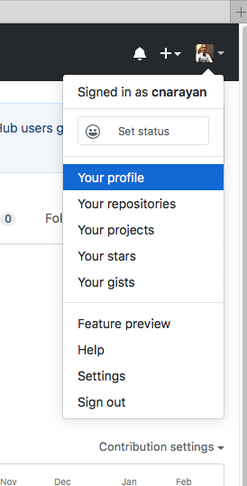
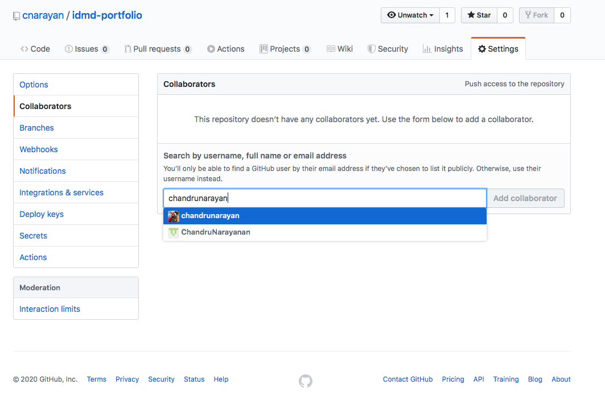

# Adding Collaborators to your Github CPJava-Portfolio
---
.
.
.
. Access Your Profile Icon on top-right

---
.
.
.
. Click on the CPJava-Portfolio link

---
.
.
.
. Click on Settings top-right and select Collaborators on Left

---
.
.
.
.
.
.
. Type chandrunarayan in searchbox and select **chandrunarayan** and click Add collaborator (DO NOT SELECT the other guy ChandruNarayanan - he is someone else!!)

---
.
.
.
.
.
. Then you should see this page - You are done, Thanks!
