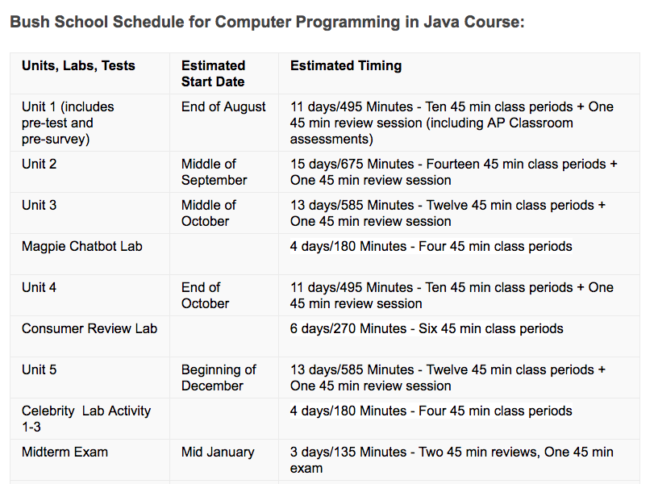
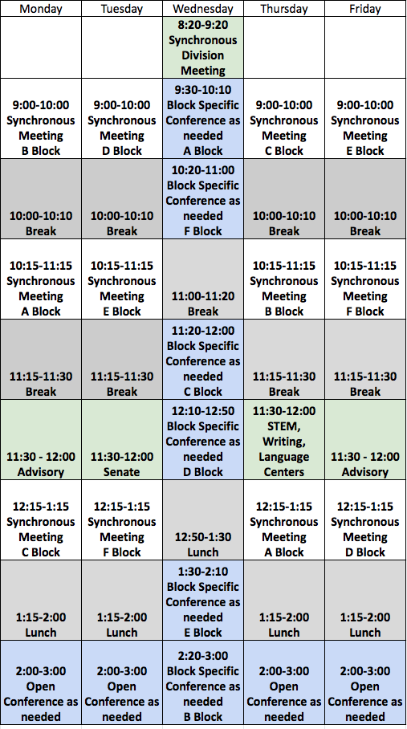

[_Bush School CPJava Fall Semester 2020_](https://chandrunarayan.github.io/cpjava/)

# Computer Programming in Java Course Main Page
In this year-long computer science course, you will learn the basics of programming in the Java language. This course includes a broad view of computer operation, the global impact of computing, and then introduces Java programming concepts, including variables, selection and object-oriented design. This course is for anyone interested in taking a first-level computer-programming course. No previous programming knowledge is required to take this course. We are looking forward to helping you explore this exciting new world!  

While the topics covered in this course are inclusive of the curriculum specified by the Advanced Placement Computer Science A (APCSA) exam, some students without prior exposure to programming might find that they require additional preparation.
## Remote Classroom Tools

In our CPJava classroom we are already using tools and techniques that are naturally adapted to a remote learning format. We will continue using our already established tools and techniques for learning CPJava.  We will add to that, a video conferencing solution  to complete our toolset needed for remote learning! All applications (except email) are to be run using your Chrome Browser on your laptop. 

1. [ZOOM for CPJava](https://zoom.us/j/5176316708) - video conferencing application - join here each day and time CPJava classes are held
2. [CPJava WEBSITE](https://chandrunarayan.github.io/cpjava/) - lessons, exercises, projects, student-portfolios, references
3. [SLACK Instant Messaging](https://app.slack.com/client/TTS9Y46VC) - differentiated classroom, code extract, bug fixes, instant help, quick challenges
4. [GITHUB repository](https://github.com/) - code submissions for exercises and projects, published student portfilios
5. [P5JS Web Editor](https://editor.p5js.org) - web code editor for p5js
6. [Student Portfolios](student-work.md) - Links to Student Porfolios
7. [Online textbook](https://drive.google.com/drive/u/2/folders/15GK0VESxqTvYGst9EtvILshb0MGlO4c5) - Getting Started with P5JS 
8. [Bush PORTAL](https://bush.myschoolapp.com/app/faculty#academicclass/109608285/0/bulletinboard) - links for all tools, official assignments, schedules, syllabus, grade rubric
9. Conference Appointments
    *    [Please schedule 1-1 Wed Conferences here](https://calendly.com/chandru-narayan/conf_wed_cpjava_a_block)
    *    [Please schedule 1-1 Mon-Tue-Thu-Fri Conferences here](https://calendly.com/chandru-narayan/conf_montuethufri)

10. EMAIL - check your Bush email multiple times a day. Default communication method when all else fails! 

#### [Computer Programming in Java Course Schedule](./CPJava_course_schedule.pdf)

#### [Remote Schooling Daily Schedule](./BSDS.png)

#### A Reminder
We are all going through some extraordinary times due to the coronavirus.  I would like to ask you to think about those among us who are suffering due to this affliction. Let us take time to be vigilant about [washing hands frequently](https://www.cdc.gov/handwashing/when-how-handwashing.html), not touching our face and avoiding being in large groups. Most of all, be calm about things beyond our control.

![alt text][washhands]

## Course Description

Software influences all aspects of contemporary visual culture. Students will explore the essentials of Computer Programming including: cconditional control structures, iteration, data structures, functions, classes, objects, and event-driven design. We will create projects based on student interest including, but not limited to video games, installation art, and simulations of biological and social phenomena. We will learn and create using the programming language Javascript and the library p5.js, a full featured library that allows one to create interactive digital art for the web. To see examples of the interactive digital media you can create with code, [watch this video](https://www.youtube.com/watch?v=HerCR8bw_GE) by the creators of p5.js.

## Course Documents

* [Syllabus](syllabus.md)
* [Topic List](topic-list.md)
* [Student Portfolios](student-work.md)
* [Exercise/Project Requirements](final-project.md)

## Course Links

* Course Website: [CPJava 2020 Website](https://chandrunarayan.github.io/cpjava/)
* Online textbook: [Getting Started with P5JS](https://drive.google.com/drive/u/2/folders/15GK0VESxqTvYGst9EtvILshb0MGlO4c5)
* P5JS Basics: [Wiki Page for Help Examples and Reference](https://github.com/processing/p5.js/wiki/JavaScript-basics)
* Other Course materials: [Google Drive CPJava](https://drive.google.com/drive/folders/1iRMwhQ_s2qayCJFFZz6Z3hnwFvgMTEI4?usp=sharing)
* Assignment Submissions via [Your Github Site](https://github.com/)
* Slack Instant Messaging - [CPJava 2020 Slack](https://cpjava2020.slack.com/)

## Course Credit

This course draws from the materials used in the UW Human Center for Design Engineering Master of Science curriculum. Significant credit is also due to the many member founders of the Processing Foundation whose tireless efforts have advanced the cause for open, accessible, and free CS education across the world.

## Lessons

### [Week 1](lessons/week1)

_Topics: Installfest, git, github, why p5.js, environment setup, using the reference, digital color, coordinate system_

* [Overview](lessons/week1)
* [Installfest](lessons/week1/installfest.md)
* [Portfolio Setup](lessons/week1/portfolio.md)
* [Exercises](lessons/week1/readme.md)
* [Project: Robot](lessons/week1/exercises/robot.md)

### [Week 2](lessons/week2)

_Topics: Programming flow, animation loops, functions, parameters, variables, max, min, sound_

* [Overview](lessons/week2)
* [Exercises](lessons/week2/readme.md)

### [Week 3](lessons/week3)

_Topics: Conditional statements, logical operators, events, mouseX, mouseY, mouesIsPressed, frameCount, random, dist, mousePressed, mouseReleased_

* [Overview](lessons/week3)
* [Exercises](lessons/week3/readme.md)

### [Week 4 After Winter Break](lessons/week4)

_Topics: keyPressed events, while and for loops, using text and fonts, using images_

* [Overview](lessons/week4)
* [Exercises](lessons/week4/code)
* [Project: Creativity Exploration](lessons/week4/homework/creativity-exploration.md)

### [Week 5](lessons/week5)

_Topics: Review for loops, while loops, arrays, return statements, data vis_

* [Overview](lessons/week5)
* [Exercises](lessons/week5/code)
* [Project: Data Visualization](lessons/week5/homework/data-visualization.md)  (For Advanced Pathway Students Only)

### [Week 6 - First week of Remote Schooling!](lessons/week6)

_Topics: complete creativity expl, data vis, HTML/CSS_

* [Overview](lessons/week6)
* [Project: Creativity Exploration](lessons/week4/homework/creativity-exploration.md)
* [Project: Data Visualization](lessons/week5/homework/data-visualization.md) (For Advanced Pathway Students Only)
* [Exercises: Student Portfolio HTML/CSS](lessons/week6/homework/portfolio-html-css.md) (For Advanced Pathway Students Only)

### [Week 7 - 3/16](lessons/week7)

_Topics: Exercise and Project submissions ahead of comments_

* [Overview](lessons/week8)
* Discuss Submissions Status and catch-up for Standard Pathway Students
* Timer based trigger exercise for Advanced Pathway Students 

### [Week 8 - 3/23](lessons/week8)

_Topics: Motion, Functions_

* [Overview](lessons/week8)
* Explore Motion, Functions
* STD Team: [Exercise: Moving Pacman](lessons/week8/code/moving_pacman.md) *DUE 3/26*
* ADV Team: [Project: Submit Data Viz](lessons/week5/homework/data-visualization.md) *DUE 3/23*
* ADV Team: [Exercise: Exploding Bubbles](lessons/week7/code/exploding_bubbles.md) *DUE 3/23*
* ADV Team: [Project: Moving Robot](lessons/week8/code/moving_robot.md) *PART 1 DUE 3/26*

### [Week 9 - 3/30](lessons/week9)

_Topics: Arrays, Functions, User Input_

* [Overview](lessons/week9)
* STD Team: [Exercise: Moving Pacman](lessons/week8/code/moving_pacman.md) *DUE 3/26*
* ALL Teams: Learn to use Arrays, Functions [Project: Pins and Threads](lessons/week9/code/pins_threads.md)
* STD Team: [Slack Code Extract in #stdteamch](https://app.slack.com/client/TTS9Y46VC/GUMN732S0)
* ADV Team: Work on Part 2 & 3 of [Project: Moving Robot](lessons/week8/code/moving_robot.md)

### [Week 10 - 4/6 to 4/8 - SHORT WEEK](lessons/week10)

_Topics: Conferences and Catch Up on Assignments_

* Conferences 1-1
    *    [Please schedule 1-1 Wed Conferences here](https://calendly.com/chandru-narayan/conf_wed_cpjava_a_block)
    *    [Please schedule 1-1 Mon-Tue-Thu-Fri Conferences here](https://calendly.com/chandru-narayan/conf_wed_cpjava_a_block)
* Help with Assignments
* SPRING BREAK STARTS 4/9

### Week 11 - 4/13 NO CLASSES - SPRING BREAK -

_No Classes_

### [Week 12 - 4/22 and 4/23 - Sync Sessions](lessons/week12)

_Topics: Recursion, Fractals_
* [Overview](lessons/week12)
* [Exercises](lessons/week12/code/recursion)

### [Week 13 - 4/27](lessons/week13)

_Topics: Recursion, Complex Numbers, Mandelbrot Set, Array Lists_
* [Overview](lessons/week13)
* Exercises - No Coding assignment this week. [Setup Calendly meeting](https://calendly.com/chandru-narayan/conf_wed_cpjava_a_block) with me for discussing your final project

### [Week 14 - 5/4](lessons/week14)

_Topics: Objects, Array Lists, Perlin Noise_

*  [Overview](lessons/week14)
*  [Exercises](lessons/week14/plan/bubbles.md)

### [Week 15 - 5/11](lessons/week15)

_Topics: Catching-up on assignments and 1-1 Conferences_

* [Overview](lessons/week15)
* Exercises: All pending assignments due in Student Portfolio by May 14th 
* Class Work: 1-1 Conferences and [Final Project Ideas](lessons/week15/plan/inspiration.md)

### [Week 16 - 5/18](lessons/week15/plan/inspiration.md)

_Topics: FINAL PROJECT WEEK 1_

* Class Work: Work on Final Project and 1-1 Conferences, Due May 28th

### [Week 17 - 5/25](lessons/week17)

_Topics: FINAL PROJECT WEEK 2 AND FINAL PRESENTATIONS_

* Class Work: Final Project Completion by May 28th and Peer Sharing Presentations
* [Student Portfolios](student-work.md)

* [CPJava Students Congratulations!](https://editor.p5js.org/cnarayan/present/yIYhIOSom)
![alt text][congrats]
### Week 18 - 6/1

_Topics: PEER SHARING - FINAL PROJECT PRESENTATION_

* Class Work: Peer Sharing Final Project Presentations

[washhands]: https://www.cdc.gov/handwashing/images/GettyImages-514363103-medium.jpg "Wash Hands"

[congrats]: congrats.png "Congrats"

