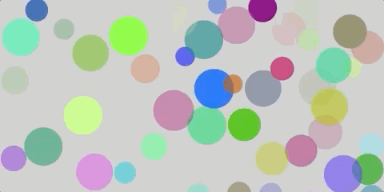

[_Bush School CPJava Spring Semester 2022_](https://chandrunarayan.github.io/cpjava/)

## Bouncing Bubbles Java Program

<a href="https://chandrunarayan.github.io/sketches/bubbles" target="blank">Click here for live code of bouncing bubbles and try clicking them inside resulting new tab or window. Like what you see? This course will be all about developing skills to simulate nature on your computer in a fun, engaging manner and learn Java on the side!</a>

# CPJava - Computer Programming in Java Course

This course is designed to introduce computer programming in the Java language. Learning to use a computer language is a necessary skill for all students regardless of discipline. In this course we will teach the fundamentals of computer programming from the stand point of simulation, automation, and problem solving of real-world systems and natural processes. At the same time, the design and implementation of computer programs is taught from the context of fundamental aspects of computer science, including the development and analysis of algorithms, the development and use of fundamental data structures, the study of standard
algorithms and typical applications, and the use of logic and formal methods. 

In addition, the year-long course, which started last Fall, will cover many of the topics necessary for preparation to the AP Computer Science A (APCSA) examination in Spring of this year. This is an introductory course in computer programming using Java. As such, no specific programming prerequisites are needed to take this course. However, additional preparation may be needed to fully prepare a student for the APCSA exam with no prior knowledge of computer programming.

### [Click here for a Complete Course Syllabus](src/CPJava_Syllabus.pdf)

### Remote Classroom Tools

In our CPJava classroom we are already using tools and techniques that are naturally adapted to a remote learning format. We will continue using our already established tools and techniques for learning CPJava.  We will add to that, a video conferencing solution  to complete our toolset needed for remote learning! All applications (except email) are to be run using your Chrome Browser on your laptop. 

1. [CPJava WEBSITE](https://chandrunarayan.github.io/cpjava) - lessons, presentation, examples, exercises, projects, student-portfolios, references
1. [CPJava Syllabus](src/CPJava_Syllabus.pdf) - Course Description, Syllabus, Grading Rubric etc.
1. [Google Classroom](https://classroom.google.com/c/MzkyMDU1MDY0Njc4) - Google Classroom for course Assignments and student administrative materials
1. [GITHUB repository](https://github.com/) - code submissions for exercises and projects, published student portfilios - Login/Register with Bush ID
1. [Processing Editor (IDE) Download](https://processing.org/download) - Code editor download for Java and Processing languages - Get Stable Release v. 3.5.4 or greater
1. [Visual Code Editor (IDE) Download](https://code.visualstudio.com/download) - Login/Register with Bush ID
1. [Trinket Exercises](https://trinket.io/chandru-narayan-9569/courses/cpjava-fall-2021) - Web-Based Java Exercises
1. [Codingbat Exercises](https://chandrunarayan.github.io/cpjava/#codingbat-practice-topics) - Web-Based Java Exercises
1. [CSAwesome Online Text](https://csawesome.runestone.academy/runestone/books/published/csawesome/index.html) - CSAwesome Online Text
1. [Online Textbook The Nature of Code](https://drive.google.com/file/d/1qZtNgUW-sAeSKF2FTZC5OXv-4q-09ye3/view?usp=sharing) - Download a local copy
1. [Online Textbook Think Java](https://books.trinket.io/thinkjava2/index.html) - Web reference
1. [The Coding Train](https://www.youtube.com/channel/UCvjgXvBlbQiydffZU7m1_aw) - Youtube Video Examples from the Processing Foundation
1. [Bush PORTAL](https://bush.myschoolapp.com/app/faculty#academicclass/110863906/0/bulletinboard) - links for all tools, official assignments, schedules, syllabus, grade rubric
1. [SLACK Instant Messaging](https://cpjava2020.slack.com/archives/C02D12AE94P) - communication for differentiated classroom, code extracts, bug fixes, instant help, quick challenges. You will receive an invitation. email communication is discouraged for this purpose.
1. [Bush EMAIL](mailto:chandru.narayan@bush.edu) will be used for administrative, one-on-one communications as necessary. Please check this once a each day during the Semester. 
1. [Zoom Conference Appointments](https://calendly.com/chandru-narayan/conf-with-chandru)
1. STEM Center Support - Roman Rothstein will be your STEM Center support consultant. He took the CP Java class last year and speak with you with direct experience!  Best way to contact him is via email Roman.Rothstein@bush.edu

    
### [Downloadable CPJava Course Schedule 2021-2022](src/schedule_v2.png) 

Schedule updated 03.28.22
![alt text][schedule]

## Learning Modes
### Learning by Doing First - Student-Based Asynchronous Workflow
In this mode of learning we will simultaneously start a consolidated student-paced sessions spanning multiple Java Units, and by working on programming projects within [Paired Programming teams](#paired-programming-teams).  We will mostly be using this workflow model, switching to Synchronous teacher-led sessions in small bursts as needed.
### Doing by Learning First - Teacher-Led Synchronous Workflow
We will use this method of learning sparingly, reserved for difficult topics that might require a lecture-based instructional unit.  The [lesson plans are published](#student-paced-sessions-for-java-units) and always available as a reference while we live in the world of Asynchronous "Learning by Doing First" model above.

## Typical Workflow
1. Student attends CPJava classes in-person at Bush Campus

2. There are 11 Units in this course

3. Each Unit will have student-paced asynchronous and lecture-based  sessions that will guide the coverage of the content in each Unit

4. Each Unit will also have Exercises and Projects to complete on online sources.  These are assigned via the [Google classroom](https://classroom.google.com/w/MzkyMDU1MDY0Njc4/t/all)

5. Exercises are short code extracts, videos to watch etc. Projects are complete solutions (programs) that you will write to meet a given specification.

6. Complete these and submit them to Github these as directed.  Projects will always have a code submission that is due. In some cases exercises may not have a code submission, but you will still practice them online.

7. Once you complete the exercises and projects, mark them as complete in the [Google classroom](https://classroom.google.com/w/MzkyMDU1MDY0Njc4/t/all). If you actually submitted code to Github, paste a link in the Google classroom assignment before marking it as complete.

### Expectations for School Work
![alt text][schoolwork]

## Paired Programming Teams
In the world of programming - [collaboration with others is everything](https://youtu.be/q7d_JtyCq1A)!.  We will model that in our learning process in the classroom. We will learn by doing and by pairing with others. Each person in a paired team will have the opportunity to teach and to learn from each other. We will be using the Paired Programming teams for team for learning Java and projects. ** Please provide me the Github Account usernames that you created **.  The Paired Programming projects will be published at this location.  I have updated paired programming teams for the 2nd-term also keeping in mind the students remote/on-campus students and those taking the APCSA exam.
 
### Team Rainier 
* Grace, Noah

### Team Hood 
* Kaito, Miguel

### Team St Helens 
* Luke, Tully

### Team Stevens 
* Ethan, Chandru

### Team Baker 
* 

## Lesson Schedule

## Student Paced Sessions for Java Units
* done[Unit 0 Java Introduction First week](lessons/unit1/src/CPJavaIntro_v3.pdf)
* done[Units 1 2 3 Consolidated Intro to Java Variables Operators Student Paced Sesssion](https://docs.google.com/presentation/d/1SEB8hbirhy00kq0oxLhQX2xcyC_HvaIw35V8pq82INw/edit#slide=id.g97cdd6c7ea_0_0)
* done[Units 4 5 Loops & Objects Student Paced Session](https://docs.google.com/presentation/d/1HC_K5tqfny5QYTdENnDpsQO-nGAAWua_YOQRc18V2IU/edit?usp=sharing)
* done[Unit 6a Arrays Student Paced Sesssion](https://docs.google.com/presentation/d/16rYe06ohSndVfIjs3WSlVSaD_h0CjnMLGbMfvEbcggI/edit?usp=sharing)
* done[Unit 6b Arrays of Objects Student Paced Sesssion](https://docs.google.com/presentation/d/1bhgbqk9DAEzQG5ZFXYlGQ4CqQfVvieKUeOftVlC7P2Q/edit?usp=sharing)
* done[Unit 7a Array List Student Paced Sesssion](https://docs.google.com/presentation/d/1cnaJQR97NmguD3ZGeLL-Rum8TVj_qA0wHxEyVr37K9s/edit?usp=sharing) 
* done[Unit 7b For Each Loop Student Paced Sesssion](https://docs.google.com/presentation/d/1NTMFNzH-FB3Pfsnozkuu4lYZre3WNNLI6eAyzpNOJg8/edit#slide=id.p1)
* done[Unit 9a Inheritance & Encapsulation Student Paced Sesssion](https://docs.google.com/presentation/d/1U6Q4y2aVB-DTWi-jB2GYJP2BUIu_k2O3yY6iDY9w-Mw/edit)
* done[Unit 2a String Objects & Methods and Google Billboard Project](https://drive.google.com/open?id=1H9tzGeTWetjzUz1G450NGxbEO5xZl3BvacfkFWsvWRE&authuser=0)
* done[Unit 2b String Methods & Pointers and Piglatin Project](https://drive.google.com/open?id=1XLlg2WK9z2RQoCVq5l0EaKquK1Mhw4WYbfshck_Rujw&authuser=0)
* done[Unit 8 2D Arrays Tables](https://docs.google.com/presentation/d/1cIgGz7huTaKrsFC5OKXdKNQ9ftwHSnWO6fjzegs7H0w/edit?usp=sharing)
* TO-DO[Unit 10a Recursion and Sierpinski Triangles](https://docs.google.com/presentation/d/1Ef1iENxFbYeJy7XDUlbV9JTiVYeoUkeXxrpcdx6UiwE/edit?usp=sharing)
* OPTIONAL[Unit 10b Recursion and Fibonacci Sequence](https://docs.google.com/presentation/d/19gdc2QhdPKWhc-BZzwau2WEatgVQI2ftLCHv337OUPc/edit?usp=sharing)
* OPTIONAL[Unit 10c Recursion and Fractals](https://docs.google.com/presentation/d/1aR38R14PDpmxgmxdUPdc1ueedpyYKNXf8x0EmPezd0U/edit?usp=sharing)
* TO-DO[Unit 10d Searching - Linear Binary Recursive Search](https://docs.google.com/presentation/d/1DW8ui1wq-oD36bLh8V1L0Am2ZW33LLORZDvMT31DWkc/edit?usp=sharing)
* TO-DO[Unit 10e Sorting - Sort & Merge](https://docs.google.com/presentation/d/1-f4OU7J88OAA-sbP0U2R_0-3bt1vucoMBUH3U2z5C1A/edit?usp=sharing)

## Student Paced Sessions for Projects
* done[Unit 0 Processing Primer Scales Project](https://docs.google.com/presentation/d/1oGEPH8JPehlrZLI9IREmoKrNd192qZ_DuNtancZooY4/edit?usp=sharing)
* done[Unit 1 Using MathDotRandom in the Lightning Project](https://docs.google.com/presentation/d/1ga570E_dgM4iSPyWmaa2AmE9roI63Eoe8VdkLu8fdQ4/edit#slide=id.g40fbbe7893_0_24)
* done[Unit 9b Asteroids Project Part 1](https://docs.google.com/presentation/d/1HfHQTei9qgkBEBhNqUKqmAc6g2V3x8FDprajTp5IZuE/edit?usp=sharing)
* done[Unit 9c Asteroids Project Part 2](https://docs.google.com/presentation/d/1pPeUvTAbIjtZYvfQIv54BDuunra8H6imO654amT6NI4/edit?usp=sharing)
* done[Unit 9d Asteroids Project Final Part 3](https://docs.google.com/presentation/d/1eSpNZiI6WjTBA4Jn_s_0pSicocsRXhOUnGaTOms80CM/edit?usp=sharing)
* [Vectors](https://docs.google.com/presentation/d/1H_v-gJwiZyaRqGt4j-gnPoGeW3QGNZEhcqAEEO4Nzf0/edit?usp=sharing)

## Student Projects
* ### [Click Here For Student Projects Currently In-Work](student-githubs.md)
* [Help with errors running Processing in Github](https://chandrunarayan.github.io/ProcessingInGithub/)

## Processing Project Specifications & Repositories
* done[Scales Project](https://github.com/chandrunarayan/Scales)
* done[Lightning Project](https://github.com/chandrunarayan/Lightning)
* done[Dice Project](https://github.com/chandrunarayan/Dice)
* done[Chemotaxis Project](https://github.com/chandrunarayan/Chemotaxis)
* done[Rising Bubbles Project](https://classroom.google.com/c/MzkyMDU1MDY0Njc4/a/NDM0NTIzNzc4MjQ1/details)
* done[Starfield Project](https://github.com/chandrunarayan/Starfield)
* done[Snowflake Live Coding Project](https://chandrunarayan.github.io/Snowflake/)
* done[Asteroids Part 1 Project](https://github.com/chandrunarayan/AsteroidsGame)
* done[Asteroids Part 2 Project](https://github.com/chandrunarayan/AsteroidsPart2)
* done[Asteroids Part 3 Project](https://github.com/chandrunarayan/AsteroidsPart3)
* done[Google Billboard Project](https://github.com/chandrunarayan/GoogleBillboard)
* done[Piglatin Project](https://github.com/chandrunarayan/Piglatin)
* done[Palindrome Checker Project](https://github.com/chandrunarayan/PalindromeChecker)
* TO-DO[Linear Binary Search Functions Project](https://github.com/chandrunarayan/LinearBinarySearch)
* OPTIONAL[Sierpinski Triangles Project](https://github.com/chandrunarayan/Sierpinski)
* FINAL[Game of Life Project with extensions](https://github.com/chandrunarayan/GameOfLife)
* FINAL[Custom Newton's Boids - a physics simulation Project]()
* FINAL[Custom Genetic Objects - a genetic evolution simulation Project]()

##  [Codingbat Practice Topics](https://codingbat.com/home/chandru.narayan@bush.edu)
Make sure you login to codingbat with your username before attempting problem sets. 

Completion of these problem sets are not rquired for the CPJava course. However, it is highy recommended and essential in preparing for the APCSA exam if you plan to take it. See suggested schedule sequence below by topic. See additional details about the APCSA exam in the sections below

Suggested Schedule of Completion updated 03.28.22 

| Sequence | Schedule Topic | Codingbat Problemset
| :--- | :--- | :--- |
| 1 | ***DONE*** Primitives | [Primitives](https://codingbat.com/home/chandru.narayan@bush.edu/intbool1)
| 2 | ***DONE*** Functions | [Functions1](https://codingbat.com/home/chandru.narayan@bush.edu/functions1) [Functions2](https://codingbat.com/home/chandru.narayan@bush.edu/functions2) [Functions3](https://codingbat.com/home/chandru.narayan@bush.edu/functions3)
| 3 | ***DONE*** Arrays | [Arrays1](https://codingbat.com/home/chandru.narayan@bush.edu/arrays1) [Arrays2](https://codingbat.com/home/chandru.narayan@bush.edu/arrays2) [Arrays3](https://codingbat.com/home/chandru.narayan@bush.edu/arrays3) [Arrays4](https://codingbat.com/home/chandru.narayan@bush.edu/arrays4)
| 4 | ***DONE*** Array List | [ArrayList1](https://codingbat.com/home/chandru.narayan@bush.edu/arraylist1) [ArrayList2](https://codingbat.com/home/chandru.narayan@bush.edu/arraylist2) [ArrayList3](https://codingbat.com/home/chandru.narayan@bush.edu/arraylist3)
| 5 | ***DONE*** Fall Review | [FallReview1](https://codingbat.com/home/chandru.narayan@bush.edu/fallreview1) [FallReview2](https://codingbat.com/home/chandru.narayan@bush.edu/fallreview2)
| 6 | ***DONE*** String | [Googlebillboard](https://codingbat.com/home/chandru.narayan@bush.edu/googlebillboard)
| 7 | ***DONE*** String & Pointers | [Piglatin](https://codingbat.com/home/chandru.narayan@bush.edu/piglatin)
| 8 | ***DONE*** String & Pointers | [String1](https://codingbat.com/home/chandru.narayan@bush.edu/string1) [String2](https://codingbat.com/home/chandru.narayan@bush.edu/string2) [String3](https://codingbat.com/home/chandru.narayan@bush.edu/string3)
| 9 | ***DONE*** Array Traversal | [Palindrome](https://codingbat.com/home/chandru.narayan@bush.edu/palindrome)
| 10 | ***DONE*** 2D Arrays | [Minesweeper](https://codingbat.com/home/chandru.narayan@bush.edu/minesweeper)
| 11 |  ***DONE*** 2D Arrays | [2DArrays](https://codingbat.com/home/chandru.narayan@bush.edu/2darrays)
| 12 | Recursion | [Recursion1](https://codingbat.com/home/chandru.narayan@bush.edu/recursion1) [Recursion2](https://codingbat.com/home/chandru.narayan@bush.edu/recursion2) [Recursion3](https://codingbat.com/home/chandru.narayan@bush.edu/recursion3)
| 13 |  ***TODO*** Searching | [Searching1](https://codingbat.com/home/chandru.narayan@bush.edu/searching1) [Searching2](https://codingbat.com/home/chandru.narayan@bush.edu/searching2)
| 14 |  ***TODO*** Sorting | [Sorting](https://codingbat.com/home/chandru.narayan@bush.edu/sorting)

## APCSA Exam Spring 2022 - May 4th

### **New [APCSA Exam Hints](src/examhints.pdf)

### [APCSA exam will be held on Wednesday, May 4th, 2022](https://apstudents.collegeboard.org/exam-calendar)

### [Learn all about the APCSA Exam](https://apstudents.collegeboard.org/courses/ap-computer-science-a)

### [APCSA Instructional Videos](https://apcentral.collegeboard.org/pdf/available-ap-daily-videos-ap-computer-science-a.pdf?course=ap-computer-science-a) can be accessed here!

### [APCSA Review Videos](https://apcentral.collegeboard.org/pdf/ap-daily-live-review-syllabus-ap-computer-science-a.pdf) can be accessed here! If you are taking the APCSA exam this May, you will benefit by watching (and practicing!) these youtube videos as part of your review.

## Course Credit

This course draws from the book Building Java Programs: A Back to Basics Approach by Stuart Reges and Marty Stepp and materials used in the the CSAwesome curriculum. Credit for significant collaboration with CS programs taught at the Lowell High School by Art Simon in San Francisco and at the Boston Latin School by Long Nguyen is duly noted with thanks. Credit is also due to the many member founders of the Processing Foundation, especially Dan Shiffman whose tireless efforts have advanced the cause for open, accessible, and free CS education across the world.

[washhands]: https://www.cdc.gov/handwashing/images/GettyImages-514363103-medium.jpg "Wash Hands"
[congrats]: congrats.png "Congrats"
[juliaset]: julia1.gif "juliaset"
[bouncyballs]: bouncy_balls2.gif "bouncyballs"
[yoda]: yoda.gif "yoda"
[crayon]: crayon.gif "crayon"
[idice]: idice.gif "idice"
[bubbles]: https://chandrunarayan.github.io/sketches/bubbles/ "bubbles"
[schedule]: src/schedule_v8.png
[schoolwork]: src/expectations.png
[guslight]: giftable/gus2.gif "guslight"
[romanlight]: giftable/roman2.gif "romanlight"
[hannahlight]: giftable/hannah.gif "hannahlight"
[mizuki]: giftable/mizuki2.gif "mizuki2"
[zoobdice]: giftable/zoobdice.gif "mizuki2"
[romandice]: giftable/romandice.gif "romandice"
[sallydice]: giftable/sallydice.gif "sallydice"
[romantaxis]: giftable/romantaxis.gif "romantaxis"
[hannahtaxis]: giftable/hannahtaxis.gif "hannahtaxis"
[isaactaxis]: giftable/isaactaxis.gif "isaactaxis"
[gusstar]: giftable/gusstar.gif "gusstar"
[mizukistar]: giftable/mizukistar.gif "mizukistar"
[chloestar]: giftable/chloestar.gif "chloestar"
[hannahstar]: giftable/hannahstar.gif "hannahstar"
